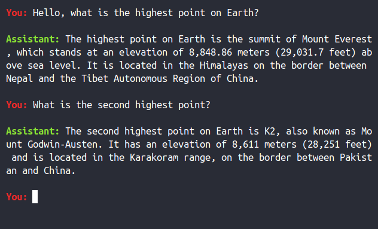

# jutella

[](https://github.com/dmitry-markin/jutella/blob/master/LICENSE) [](https://crates.io/crates/jutella) [](https://docs.rs/jutella/latest/jutella/)

Chatbot API client library and CLI interface. Currently supports OpenAI chat API.


## Command line interface

To get started with CLI, put your API key and endpoint into `~/.config/jutella.toml`. See a config [example](https://github.com/dmitry-markin/jutella/blob/master/config/jutella.toml).




## Library

To use the chat API, initialize `ChatClient` with `api_key` and `ChatClientConfig`:

```rust
let mut chat = ChatClient::new(api_key, ChatClientConfig::default());
```

Request answers via `ChatClient::ask()`:

```rust
let answer = chat.ask("What is the highest point on Earth?".to_string())?;
println!("The answer is: {answer}");
```

`ChatClient` keeps the conversation context and sends it with every `ask()` to the chatbot API.


## Future plans

Expect breaking changes in the API and transition to async requests.
